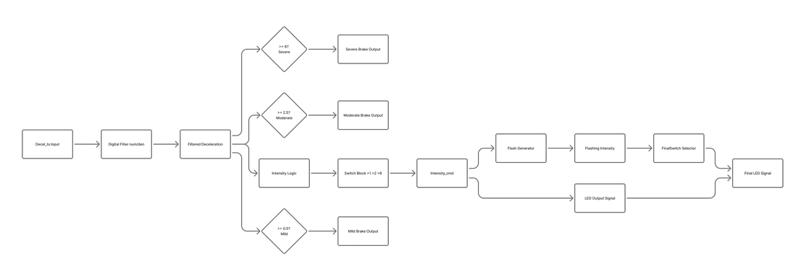
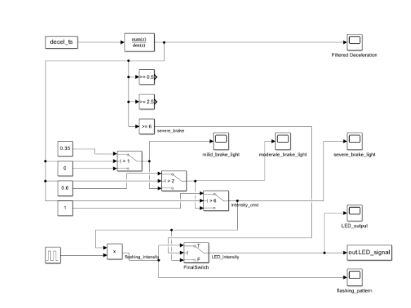
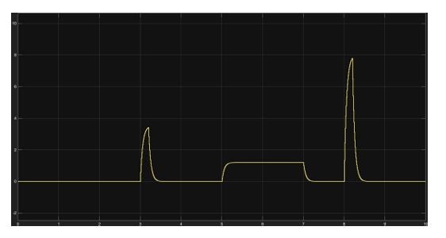
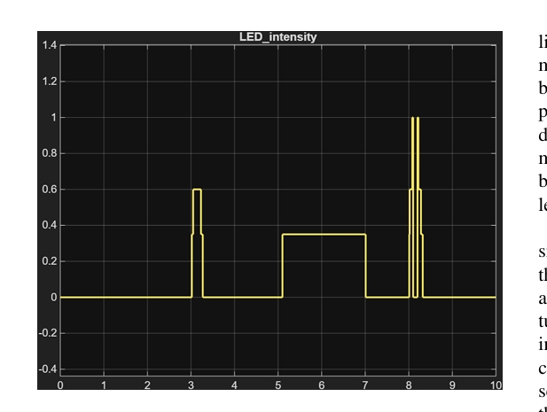

# Adaptive Brake Light System using MATLAB/Simulink

A control-based intelligent braking system designed to dynamically adjust brake light intensity based on vehicle deceleration to improve road safety and reduce rear-end collisions.

---

## 📌 Overview

Conventional brake lights operate in a binary ON/OFF manner and do not communicate the severity of braking to trailing drivers.

This project presents an Adaptive Brake Light System (ABLS) that uses real-time vehicle deceleration data to vary brake light intensity and flashing behaviour using PWM control. The system improves driver awareness and reduces reaction delay in sudden braking scenarios.

---

## ⚙️ System Architecture

The ABLS consists of three major subsystems:

- Sensing Stage – Measures vehicle deceleration
- Processing Stage – Filters noise and classifies braking severity
- Actuation Stage – Adjusts LED intensity using PWM

---

## 🧠 Control Strategy

The system implements:

- First-Order Low-Pass Filter for signal smoothing
- Threshold-Based Braking Classification
- Hysteresis Logic to prevent frequent toggling
- PWM-Based Adaptive Brightness Control

Braking conditions are classified as:

| Braking Level | Deceleration Range | LED Brightness |
|--------------|--------------------|----------------|
| Mild         | 1 < a < 2          | 35%            |
| Moderate     | 2 ≤ a < 6          | 60%            |
| Severe       | a ≥ 6              | 100% (Flashing)|

---

## 🔁 System Workflow

---

## 🧩 Simulink Model

---

## 📉 Deceleration Input Profile

---

## 💡 LED Intensity Response

---

## 📄 Project Report
Full documentation available here:  
[Adaptive_Brake_Light_System_Report.pdf](Adaptive_brake_light_system.pdf)

---

## 📈 Applications

- Automotive Safety Systems  
- Driver Assistance Systems  
- Intelligent Transportation Systems  
- Adaptive Vehicle Communication
